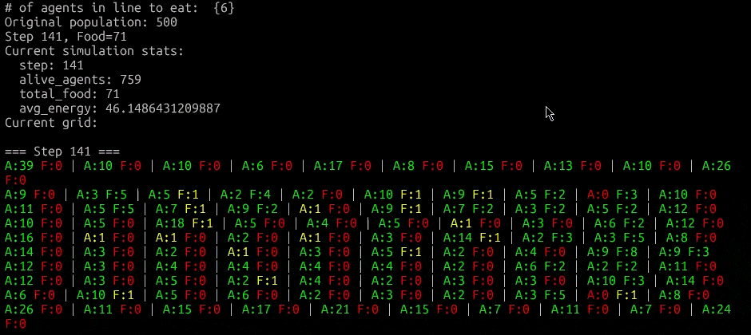
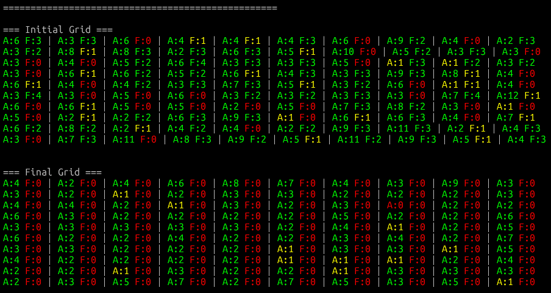
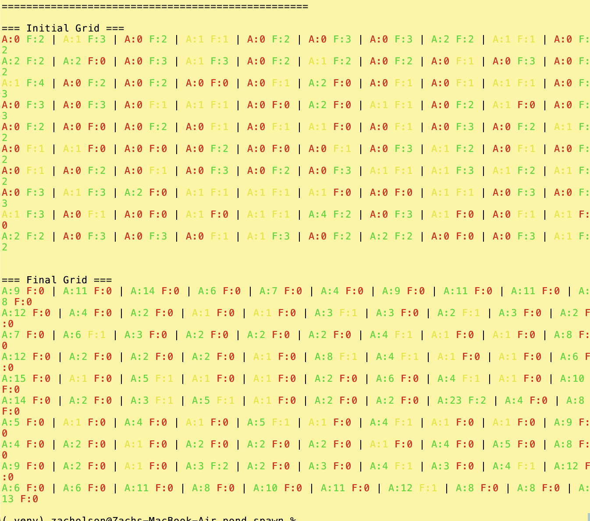

# pond_spawn



Tossing out the old AI README and writing my own. This will serve double-duty as a devlog of sorts as I stumble my way through this.

## Running the Simulation

```bash
# Basic usage
python -m cli.cli_sim_starter

# Custom parameters
python -m cli.cli_sim_starter --population 100 --steps 500 --grid-size 20

# Fast run without visuals
python -m cli.cli_sim_starter --no-visual --steps 5000

# Get help
python -m cli.cli_sim_starter --help
```

# OVERVIEW
<h2>This is my attempt to understand a: neural networks, and b: artificial life simulations.</h2>

*************************
******************************
*************************

# OBSERVATIONS
<ul>
    <li>The Callums demonstrate interesting behavior with the current genomic and environmental settings. A genome that favors conserving energy at the expense of procreation predictably results a population collapse; A genome that favors reproduction tends to have about 33% of their total energy level on average across the population.</li>
    <li>The Callums are still clustering at the edges of the map, so I'm wondering if I should add the ability to loop around if you hit the edges. It also may be that the Callums are just stupid and need more options to choose from.</li>
    <li>Longer sims with more steps and larger populations make my pc cry.</li>
</ul>

# DEV LOG

*************************
******************************
*************************

# November 1st, 2025
The Callums are making decisions that seem to support a stable, if small, population. I am now satisfied with this rough simulation and it's parameters. Snapshot: 
TODO
<ul>
    <li>Add 4 more outputs to the brains output layer. This will allow us to make the Callums decisions more nuanced</li>
    <li>Expand the genome to have two new features: attack and defense</li>
    <li>Add logging to decisions and <s>snapshots of state per tick</s> so I can understan why the Callums do what they do</li>
</ul>

We also added a GitHub Action requiring Ruff linting before merge.

# October 28th, 2025
I noticed that in each run the agents, now known as "Callums", were congregating on the very top of the grid. Literally row 0, all the lil guys just huddled up there. I adjusted the starting heading to be randomized instead of always facing North. The result was that the Callums now congregate on the entire perimeter of the grid, not just the top. They seem to particularly favor the corners. Example below. Apologies for the color scheme, I have a terrible eye for design.

I also made the sim take a snapshot of the initial randomized grid and the final grid for comparison.
TODO:
<ul>
    <li>Add 4 more outputs to the brains output layer. This will allow us to make the Callums decisions more nuanced</li>
    <li>Expand the genome to have two new features: attack and defense</li>
    <s>Adjust the decision making function. Callums should probably decide to leave if the tile is too crowded or they're seeing aggression/food competition</s>
</ul>

# October 26th, 2025
I tossed out the old readme (it was an ai stand-in made by Copilot) and decided to make my own. The agents brain is not choosing to 'Eat' enough, resulting in starvation, depopulation, and a HUGE accumulation of food. Thoughts on why this is below:
<ul>
    <s>Too much food, obviously</s>
    <s>The brain is too simple. There should be threshold triggers that are checked before the brain is called</s>
</ul>

With the above fixed I added a GIF to the README and am going to bed.