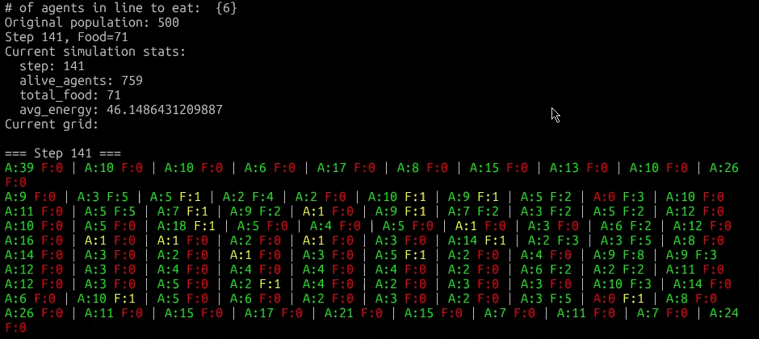
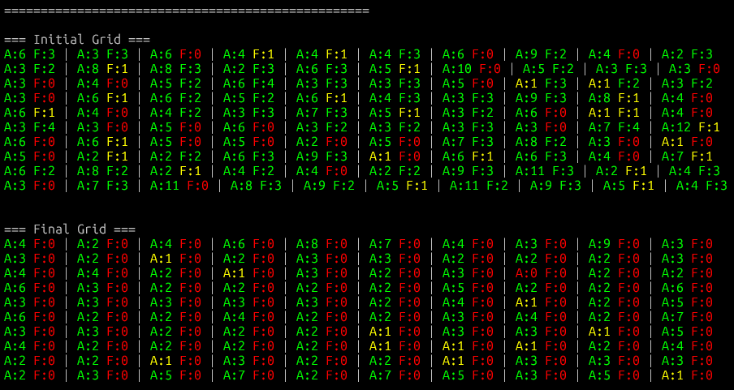
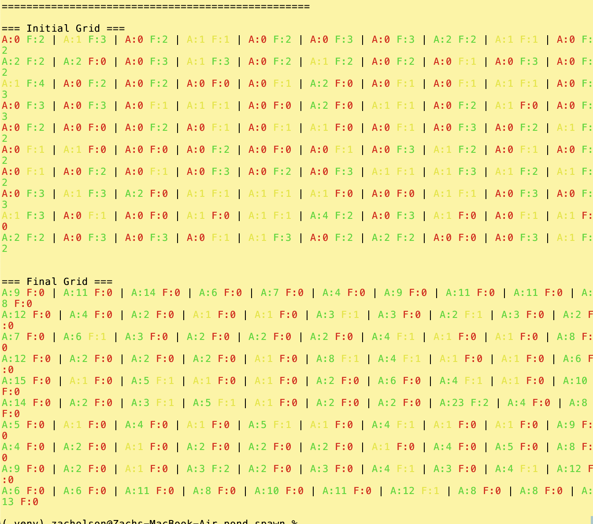

```
  ██████╗  ██████╗ ███╗   ██╗██████╗       ███████╗██████╗  █████╗ ██╗    ██╗███╗   ██╗
  ██╔══██╗██╔═══██╗████╗  ██║██╔══██╗      ██╔════╝██╔══██╗██╔══██╗██║    ██║████╗  ██║
  ██████╔╝██║   ██║██╔██╗ ██║██║  ██║      ███████╗██████╔╝███████║██║ █╗ ██║██╔██╗ ██║
  ██╔═══╝ ██║   ██║██║╚██╗██║██║  ██║      ╚════██║██╔═══╝ ██╔══██║██║███╗██║██║╚██╗██║
  ██║     ╚██████╔╝██║ ╚████║██████╔╝      ███████║██║     ██║  ██║╚███╔███╔╝██║ ╚████║
  ╚═╝      ╚═════╝ ╚═╝  ╚═══╝╚═════╝       ╚══════╝╚═╝     ╚═╝  ╚═╝ ╚══╝╚══╝ ╚═╝  ╚═══╝
```

[](https://github.com/codepapayas/pond_spawn)
[](https://github.com/codepapayas/pond_spawn/actions/workflows/ruff.yml)
[](https://github.com/codepapayas/pond_spawn/actions/workflows/pylint.yml)
[](https://github.com/codepapayas/pond_spawn/actions/workflows/coverage.yml)
[](LICENSE)


### With visuals


### Without visuals (print to console)


*************************

Tossing out the old AI README and writing my own. This will serve double-duty as a devlog of sorts as I stumble my way through this.

## RUNNING THE SIMULATION
*************************

Install dependencies first:

```bash
pip install -r requirements.txt
```

Console runner:

```bash
# Basic usage
python -m cli.cli_sim_starter

# Custom parameters
python -m cli.cli_sim_starter --grid-size 14 --population 80 --steps 1500

# Stats only, no grid dump
python -m cli.cli_sim_starter --stats-only --no-visual

# Show the randomized starting state before the sim runs
python -m cli.cli_sim_starter --show-initial

# Full help
python -m cli.cli_sim_starter --help
```

Current CLI flags for `cli_sim_starter`:

`--grid-size` · `--population` · `--population-cap` · `--food-resupply` · `--steps` · `--delay` · `--no-visual` · `--show-initial` · `--stats-only`

The CLI writes a stats chart to `charts/simulation_stats_<timestamp>.png` when the run ends.

### Pygame Visualizer
```bash
# Basic usage
python -m cli.pygame_visualizer

# Custom parameters
python -m cli.pygame_visualizer --grid-size 20 --population 200 --cell-size 30 --fps 15 --max-ticks 2000

# Full help
python -m cli.pygame_visualizer --help
```

Current visualizer flags:

`--grid-size` · `--population` · `--population-cap` · `--cell-size` · `--fps` · `--max-ticks`

Controls:

`Space` pauses/resumes the sim. `Escape` quits and generates the final stats chart.

Place your agent sprite at `assets/sprites/callumV1.png`. The visualizer rotates it by heading and falls back to circles plus heading markers if the sprite is missing.

# OVERVIEW
*************************
<h2>This is my attempt to understand a: neural networks, and b: artificial life simulations.</h2>

The current codebase is a toroidal grid-world sim with random biome generation, mutated genomes, PyTorch brains, fertility-scaled food regrowth, and both console and pygame front ends.

# CURRENT SPECS
*************************

**Brain**

The brain is built dynamically from `brains/brain.json`, not hard-coded in Python.

| Property | Value |
|----------|-------|
| Inputs | 5 normalized values |
| Current architecture | `5 → 12 → 12 → 12 → 8` |
| Hidden activations | `ReLU` |
| Output selection | `argmax` winner-takes-all |
| Learning | No backpropagation; weights change only through genome mutation |
| Parameter count | 488 trainable weights/biases |

Current perception vector:

`energy / 100` · `food_on_current_tile / 5` · `nearby_agents / 10` · `visibility-adjusted crowding` · `terrain_movement_speed × speed_trait`

The environment also applies two hard survival heuristics before brain output is used:

`low energy + no food => move`

`too many nearby agents for the available food => move`

**Action Surface**

The brain currently outputs 8 action slots:

`MOVE` · `TURN_RIGHT` · `EAT` · `REPRODUCE` · `SLEEP` · `DO_NOTHING` · `TURN_LEFT` · `ATTACK`

What is actually wired today:

All 8 outputs are currently wired in `execute_action()`, including `TURN_LEFT` via `ACTION_TURN_COUNTER = 6`.

There is also a separate combat phase after actions execute: agents with `aggression >= 0.80` may attack another agent on the same tile even if they did not explicitly choose the `ATTACK` output.

**Genome**

The genome template lives in `genomes/genome.json` and currently defines 12 traits:

`vision` · `speed` · `metabolism` · `daily_nutrition_minimum` · `energy_capacity` · `mutation_rate` · `clone_energy_threshold` · `reproduction_cost` · `intelligence` · `attack` · `defense` · `aggression`

Status of those traits in the current runtime:

`vision`, `speed`, `metabolism`, `energy_capacity`, `mutation_rate`, `clone_energy_threshold`, `reproduction_cost`, `attack`, `defense`, and `aggression` are all used by behavior or lifecycle logic.

`daily_nutrition_minimum` and `intelligence` are still defined in the genome but are not currently consumed by the sim loop.

**Environment**

| Mechanic | Current behavior |
|----------|------------------|
| World topology | Toroidal wraparound grid |
| Biome features | `movement_speed`, `visibility`, `fertility`, `food_units` |
| Initial biome food | Random choice from `0, 1, 2, 3` per tile |
| Initial energy | `100.0` |
| Initial heading | Randomized |
| Environment defaults | `Environment(grid_size=12, num_agents=300, food_units=3)` |
| CLI defaults | `grid_size=10`, `population=50`, `food_resupply=3`, `steps=1000` |
| Visualizer defaults | `grid_size=12`, `population=100`, `fps=10`, `max_ticks=1000` |
| Population cap | Optional; defaults to no reproduction cap |
| Spawn cap | Initial population capped to `2 * grid_size * grid_size` |

**Energy / Lifecycle Rules**

| Mechanic | Current behavior |
|----------|------------------|
| Passive metabolism drain | `0.1 × metabolism` every tick |
| Move cost | `terrain_speed × speed × metabolism × 0.15` |
| Turn-right cost | `0.1 × metabolism` inside `turn()` plus `0.04 × metabolism` in action execution |
| Turn-left cost | `0.1 × metabolism` inside `turn_left()` plus `0.04 × metabolism` in action execution |
| Eat gain | Up to `33.3` energy per food unit, capped by `energy_capacity` |
| Sleep effect | Adds `20 × metabolism` energy |
| Loaf / do nothing | Costs `0.005 × metabolism` and skips the next turn |
| Reproduction age window | 100 to 250 ticks inclusive of the lower check and exclusive of values above 250 |
| Reproduction minimum energy | 40 |
| Reproduction cost | `current_energy × (0.50 × reproduction_cost_trait)` |
| Offspring spawn | One adjacent wrapped tile, chosen at random |
| Offspring starting energy | `reproduction_cost + (50 × clone_energy_threshold)` |
| Natural death | Randomly assigned death age from `create_death_range()` |
| Starvation | Agent dies at `energy <= 0` |

**Food Regrowth**

Food is not replenished on a fixed timer. The environment redistributes food when:

`total_food < len(self.agents) / 50`

Each tile then gains:

`int(food_resupply_amount × biome_fertility) % 100`

That means fertile tiles accumulate food faster over time, and food stacks instead of resetting.

**Runtime Notes**

The simulation uses PyTorch for inference and will pick `cuda` automatically when available. The environment batches perception/decision work per tick, but each agent still owns its own `Brain` instance loaded from its genome weights.


# OBSERVATIONS
*************************
<ul>
    <s><li>The Callums demonstrate interesting behavior with the current genomic and environmental settings. A genome that favors conserving energy at the expense of procreation predictably results a population collapse; A genome that favors reproduction tends to have about 33% of their total energy level on average across the population.</li>
    <li>The Callums are still clustering at the edges of the map, so I'm wondering if I should add the ability to loop around if you hit the edges. It also may be that the Callums are just stupid and need more options to choose from.</li>
    <li>Longer sims with more steps and larger populations make my pc cry.</li>
    <li>It turns out the feedforward nn is actually fairly efficient given it's size and lack of backpropagation. The problem, it seems, is my horribly inefficient sim loop logic.</li>
    <li>Drawing is much harder than I initially thought.</li>
    <li>These Callum's don't procreate enough, and I think it's due to environmental pressures being non-existant. Maybe seasons?</li></s>
</ul>

# DEV LOG
*************************
<h1>December 23rd, 2025</h1>
Updating after a while. I debated on abandoning this project and just starting anew with lessons learned, but I think I want to see this one through.

A lot of this isn't as connected as I thought it was. The death logic, for example, was not working. It turns out I had written the algorithm for assigning death ages incorrectly and I honestly can't remember what direction I was going with that so, ya know, just fixed that to actually work. I also remembered that tests are a thing and started updating/adding some.

TODO
<ul>
    <li>The tests need to be accurate and reflect the current state of the program. Solo work is hard; testing keeps us on task</li>
    <li>Make a test file for the environment. A lot of important functions live there now and there is a need to know if they actually work.</li>
    <li>Connect intelligence to the decision making algorithm; Create an actual action tied to it. I think it makes sense for it to dictate the rate at which an entity makes decisions in reaction to stimuli, so somehow it needs to dampen or enhance that function.</li>
</ul>

*************************

*************************
<h1>November 15th, 2025</h1>
Artificial life simulations are hard. We fixed the energy add function. It was boundless, which satisfied the Callum's but didn't fit the sim. Will write more and update TODO later.

TODO
<ul>
    <s><li>Add 4 more outputs to the brains output layer. This will allow us to make the Callums decisions more nuanced</li>
    <li>Expand the genome to have two new features: attack and defense</li>
    <li>Add logging to decisions and snapshots of state per tick so I can understan why the Callums do what they do</li></s>
</ul>

*************************

<h1>November 10th, 2025</h1>
Today was an adventure in futility. I second-guessed myself and rewrote the food resupply logic. I thought that I would make only the first supply of food be random and then just copy/paste resources when they get down to zero and also with a regular cadence. My thinking was that plants generally grow in the same place and around the same time, so maybe I could do that. What happened was the environment would get flooded with food but somehow the Calllums would still starve. As it turns out, I just didn't know what I was doing and my first attempt was good. Switched it back to random regen with some tweaks and we're semi-functional again.

More helpful changes are listed in the commit messages but the one I'm happiest with is the enhanced logic around reproduction and lifespan. I need to add a tracker for dead agents to make sure they're actually dying of old age, but it's a step in the right direction. I realize I was getting ahead of myself by wanting to add more outputs before I refined the 4 I have now. Currently this simulation is a little more complex, but the population keeps collapsing around 200 steps in so gotta figure that one out. No TODO today. Will update that later.

TODO
<ul>
    <s><li>Add 4 more outputs to the brains output layer. This will allow us to make the Callums decisions more nuanced</li>
    <li>Expand the genome to have two new features: attack and defense</li>
    <li>Add logging to decisions and snapshots of state per tick so I can understan why the Callums do what they do</li></s>
</ul>


*************************

<h1>November 1st, 2025</h1>
The Callums are making decisions that seem to support a stable, if small, population. I am now satisfied with this rough simulation and it's parameters. Snapshot: 
TODO
<ul>
    <li>Add 4 more outputs to the brains output layer. This will allow us to make the Callums decisions more nuanced</li>
    <li>Expand the genome to have two new features: attack and defense</li>
    <li>Add logging to decisions and <s>snapshots of state per tick</s> so I can understan why the Callums do what they do</li>
</ul>

We also added a GitHub Action requiring Ruff linting before merge.

*************************

<h1>October 28th, 2025</h1>
I noticed that in each run the agents, now known as "Callums", were congregating on the very top of the grid. Literally row 0, all the lil guys just huddled up there. I adjusted the starting heading to be randomized instead of always facing North. The result was that the Callums now congregate on the entire perimeter of the grid, not just the top. They seem to particularly favor the corners. Example below. Apologies for the color scheme, I have a terrible eye for design.

I also made the sim take a snapshot of the initial randomized grid and the final grid for comparison.
TODO:
<ul>
    <li>Add 4 more outputs to the brains output layer. This will allow us to make the Callums decisions more nuanced</li>
    <li>Expand the genome to have two new features: attack and defense</li>
    <li><s>Adjust the decision making function. Callums should probably decide to leave if the tile is too crowded or they're seeing aggression/food competition</s></li>
</ul>

*************************

<h1>October 26th, 2025</h1>
I tossed out the old readme (it was an ai stand-in made by Copilot) and decided to make my own. The agents brain is not choosing to 'Eat' enough, resulting in starvation, depopulation, and a HUGE accumulation of food. Thoughts on why this is below:
<ul>
    <li><s>Too much food, obviously</s></li>
    <li><s>The brain is too simple. There should be threshold triggers that are checked before the brain is called</s></li>
</ul>

With the above fixed I added a GIF to the README and am going to bed.
